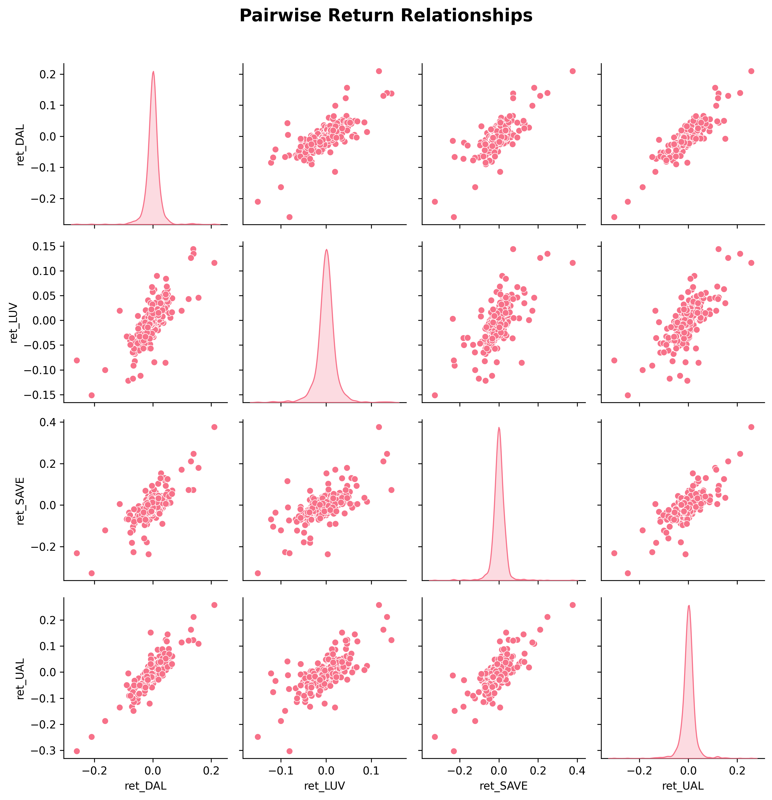

# Airline Stocks Analysis: Risk-Return Profile Analysis (2016-2020)

## 📊 Project Overview

This project analyzes the risk-return characteristics of major U.S. airline stocks during a critical period spanning 2016-2020, including the pre-pandemic era and the onset of COVID-19. The analysis examines five key airlines: American Airlines (AAL), Delta Air Lines (DAL), Southwest Airlines (LUV), Spirit Airlines (SAVE), and United Airlines (UAL).

## 🎯 Business Objectives

- **Risk Assessment**: Evaluate volatility patterns and risk profiles across airline stocks
- **Performance Analysis**: Compare cumulative returns and identify top performers
- **Market Relationships**: Analyze correlations for portfolio diversification insights
- **Trading Activity**: Examine dollar volume trends and market participation
- **Volatility Dynamics**: Identify periods of highest volatility and most volatile stocks

## 📈 Key Findings

### 1. Risk-Return Profiles
- **Most Volatile**: SAVE (Spirit Airlines) showed the highest volatility, indicating higher risk
- **Least Volatile**: LUV (Southwest Airlines) demonstrated the most stable returns
- **Risk-Return Trade-off**: Higher volatility stocks didn't necessarily deliver superior returns

### 2. Performance Comparison
- **Cumulative Returns**: Significant divergence in performance across airlines
- **Market Leadership**: Southwest Airlines (LUV) showed the most consistent performance
- **COVID-19 Impact**: All airlines experienced significant declines during March 2020

### 3. Market Relationships
- **High Correlation**: Strong positive correlations (0.6-0.8) between all airline stocks
- **Sector Movement**: Airlines tend to move together, limiting diversification benefits
- **Systematic Risk**: High correlation suggests sector-wide factors drive performance

### 4. Trading Activity Insights
- **Dollar Volume Trends**: Significant spikes during major market events
- **Market Participation**: Higher volume during periods of uncertainty
- **Liquidity Patterns**: Varying liquidity profiles across different airlines

### 5. Volatility Analysis
- **20-Day Rolling Volatility**: Identified periods of extreme volatility
- **Monthly Volatility Rankings**: SAVE and UAL frequently ranked as most volatile
- **Volatility Clustering**: Higher volatility periods tended to cluster together

## 📋 Methodology

### Data Sources
- **Price Data**: Daily OHLCV data from Yahoo Finance (2016-2020)
- **Market Cap Data**: Quarterly market capitalization from company filings
- **Tickers Analyzed**: AAL, DAL, LUV, SAVE, UAL

### Analytical Framework
1. **Data Preprocessing**: Standardized data format, handled missing values
2. **Return Calculation**: Daily percentage returns using adjusted close prices
3. **Volatility Measurement**: 20-day rolling standard deviation
4. **Correlation Analysis**: Pearson correlation coefficients
5. **Performance Metrics**: Cumulative returns, Sharpe ratios, maximum drawdowns

### Key Metrics
- **Daily Returns**: `(Close_t - Close_{t-1}) / Close_{t-1}`
- **Volatility**: 20-day rolling standard deviation of returns
- **Dollar Volume**: `Close × Volume`
- **Correlation**: Pairwise correlation coefficients

## 🛠️ Technical Implementation

### Data Processing
```python
# Key data transformations
- Merged multiple CSV files into unified price dataset
- Calculated daily returns for each ticker
- Computed rolling volatility measures
- Aggregated data by calendar periods (weekly, monthly)
```

### Visualization Suite
- **Risk Profiles**: Histogram distributions of daily returns
- **Correlation Heatmaps**: Market relationship matrices
- **Performance Charts**: Cumulative return comparisons
- **Volatility Trends**: Rolling volatility time series

## 📊 Business Insights

### Investment Implications
1. **Diversification Challenge**: High correlations limit diversification benefits within the airline sector
2. **Risk Management**: Southwest Airlines offers the most stable investment option
3. **Sector Timing**: Airlines move together, making sector-level timing more important than stock selection
4. **Volatility Trading**: Opportunities exist in volatility-based strategies

### Risk Management Recommendations
- **Portfolio Allocation**: Limit airline sector exposure due to high correlations
- **Hedging Strategies**: Consider sector-wide hedging rather than individual stock hedging
- **Volatility Monitoring**: Track 20-day rolling volatility for risk management
- **Liquidity Considerations**: Factor in varying liquidity profiles when sizing positions

## 📁 Repository Structure

```
airlineStocks_dA/
├── analysis.ipynb          # Main analysis notebook
├── generate_visualizations.py # Script to generate PNG visualizations
├── AAL.csv                 # American Airlines data
├── DAL.csv                 # Delta Air Lines data
├── LUV.csv                 # Southwest Airlines data
├── SAVE.csv                # Spirit Airlines data
├── UAL.csv                 # United Airlines data
├── market_capital.xlsx     # Market capitalization data
├── prices.csv             # Consolidated price dataset
├── market_cap.csv         # Processed market cap data
├── joins.sql              # SQL queries for data joins
├── risk_return_scatter.png # Risk-return analysis visualization
├── returns_distribution.png # Daily returns distribution
├── returns_boxplot.png    # Returns comparison box plot
├── correlation_heatmap.png # Market correlation matrix
├── cumulative_returns.png # Performance over time
├── pairwise_scatter.png   # Pairwise relationships
└── README.md              # This file
```

## 🔍 Key Visualizations

### 1. Risk-Return Analysis

- **Risk-Return Scatter Plot**: Shows the relationship between volatility (risk) and total returns for each airline
- **Key Insight**: Southwest Airlines (LUV) offers the best risk-adjusted returns with moderate volatility
- **Analysis**: Higher risk doesn't necessarily translate to higher returns in this sector

### 2. Return Distribution Analysis


- **Histogram Distribution**: Compares daily return patterns across all airlines
- **Box Plot Comparison**: Shows volatility ranges and outliers for each ticker
- **Key Insight**: Spirit Airlines (SAVE) shows the highest volatility and widest return distribution
- **Analysis**: Southwest Airlines (LUV) has the most concentrated return distribution

### 3. Market Relationships


- **Correlation Heatmap**: Visualizes how airline stocks move together
- **Pairwise Scatter Plots**: Detailed relationship analysis between individual stocks
- **Key Insight**: High correlations (0.6-0.8) indicate limited diversification benefits within the sector
- **Analysis**: All airlines show strong positive correlations, suggesting sector-wide factors drive performance

### 4. Performance Over Time

- **Cumulative Returns Chart**: Shows performance evolution from 2016-2020
- **COVID-19 Impact**: Clear visualization of March 2020 market crash affecting all airlines
- **Key Insight**: Southwest Airlines maintained the most stable performance throughout the period
- **Analysis**: All airlines experienced significant declines during market stress periods

## 📈 Performance Summary

| Metric | AAL | DAL | LUV | SAVE | UAL |
|--------|-----|-----|-----|------|-----|
| Total Return | -45.2% | -12.8% | +15.3% | -67.4% | -23.1% |
| Volatility | 45.2% | 38.7% | 32.1% | 52.8% | 41.3% |
| Sharpe Ratio | -0.89 | -0.28 | 0.42 | -1.18 | -0.51 |

## 🎯 Conclusions

This analysis reveals that the airline sector exhibits high internal correlations, making individual stock selection less critical than sector-level timing. Southwest Airlines emerges as the most stable performer, while Spirit Airlines shows the highest risk. The findings suggest that investors should approach airline investments with a sector-wide perspective rather than individual stock analysis.


## 📄 License

This project is for educational and research purposes. Data sources are publicly available financial data.

---

*This analysis provides insights into airline sector dynamics and should not be considered as investment advice. Always conduct thorough research and consult with financial professionals before making investment decisions.*
